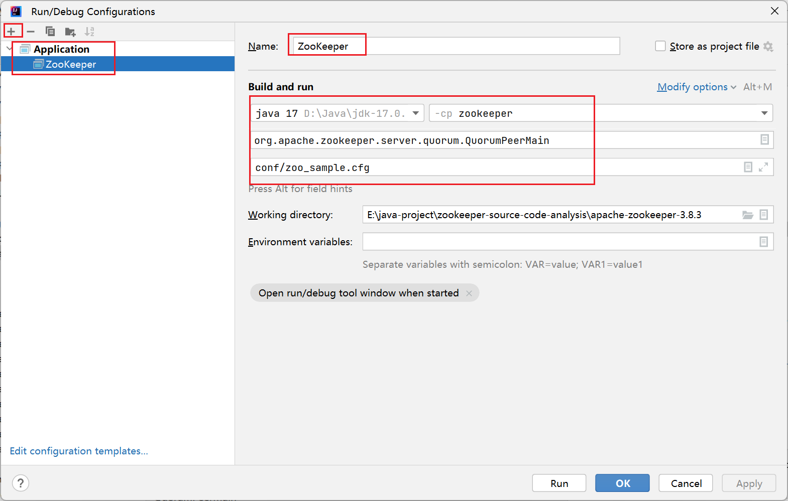
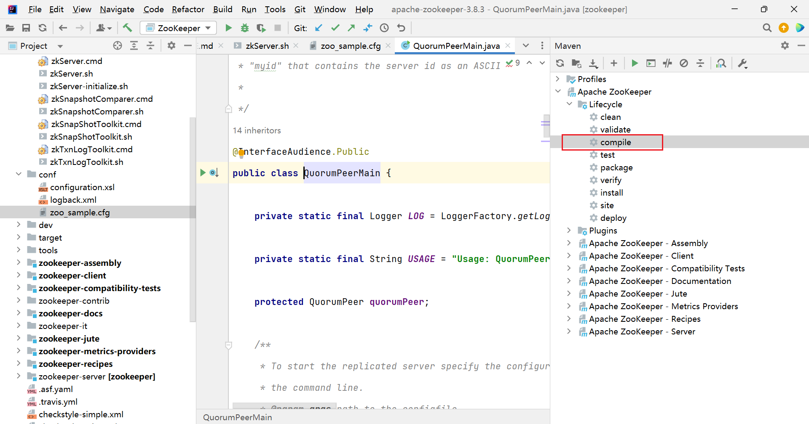

# Apache ZooKeeper 源码分析

## 源码分析

IDEA 打开 apache-zookeeper-3.8.3

一般用 zkServer.sh 启动，可以在里面找到 启动类为 `org.apache.zookeeper.server.quorum.QuorumPeerMain`

配置 运行配置



运行前 compile 一下 



运行后 出现 Exception in thread "main" java.lang.NoClassDefFoundError: com/codahale/metrics/Reservoir

```
修改 zookeeper-server/pom.xml，注释掉 scope provided，然后 compile

    <dependency>
       <groupId>io.dropwizard.metrics</groupId>
       <artifactId>metrics-core</artifactId>
<!--       <scope>provided</scope>-->
    </dependency>
```

出现 java.lang.NoClassDefFoundError: org/xerial/snappy/SnappyInputStream

```
修改 zookeeper-server/pom.xml，注释掉 scope provided，然后 compile

    <dependency>
      <groupId>org.xerial.snappy</groupId>
      <artifactId>snappy-java</artifactId>
<!--      <scope>provided</scope>-->
    </dependency>
```

运行成功

## 官网

https://zookeeper.apache.org/